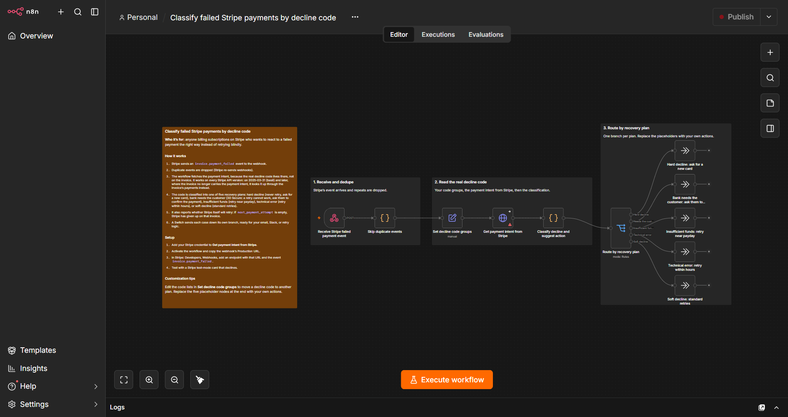

# Free n8n workflows for subscription billing

Small, self-contained n8n workflows for handling failed subscription payments. Free to use, MIT licensed. Import the JSON, add your own credential, done.

## 1. Classify failed Stripe payments by decline code

`classify-failed-stripe-payments.json`



Stripe's `invoice.payment_failed` webhook tells you a payment failed, but not why. The real decline code lives on the payment intent, and it decides what you should do next. Retrying an expired card is pointless, while `insufficient_funds` often clears if you wait for payday.

### What it does

1. Receives Stripe's `invoice.payment_failed` event on a webhook.
2. Verifies the Stripe signature against the raw request body. A request that is unsigned, signed with the wrong secret, or more than 5 minutes old stops here with a clear error message in the execution. Two signatures in the header (secret rotation) are handled.
3. Drops duplicate events (Stripe re-sends webhooks), keyed on the event id. The seen ids are kept in the workflow's static data, so they survive restarts (the last 500 are kept).
4. Fetches the payment intent to get the real `decline_code`. This works on every Stripe API version: up to 2025-03-31 the invoice carries `payment_intent`; from `2025-03-31.basil` on it does not, so the workflow looks it up through the invoice's payments (`/v1/invoice_payments`) instead.
5. Classifies it into one of five recovery plans (plus a sixth for a failed lookup):

| Route | Typical codes | Suggested action |
|---|---|---|
| `hard_no_retry` | `expired_card`, `lost_card`, `stolen_card`, `account_closed`, `do_not_try_again` ... | Do not retry. Ask the customer for a new card. |
| `auth_required` | `authentication_required` (the bank wants the cardholder to confirm, 3D Secure) | Do not retry, it cannot succeed. Send the customer the invoice's hosted payment link (`hostedInvoiceUrl` in the output) so they can confirm the payment. |
| `payday_retry` | `insufficient_funds` | Retry after 24 hours, then near the 1st or 15th. |
| `technical_retry` | `processing_error`, `issuer_not_available`, `try_again_later` | Retry within hours. Usually clears on its own. |
| `soft_retry` | everything else | Retry in 1, 3 and 7 days, then email. |
| `lookup_failed` | the Stripe call itself failed (expired key, rate limit, missing permission) | Alert yourself. Do not email the customer: this is your problem, not theirs. |

6. Reports `stripeWillRetry`. If `next_payment_attempt` is empty on the event, Stripe itself will not retry that invoice again.
7. A Switch node sends each case down its own branch, ready for your own email, Slack message, or Wait node plus retry call.

### Setup (about five minutes)

1. In n8n, create a new workflow, open the menu, choose Import from File, and pick the JSON.
2. Open **Get payment intent from Stripe** and add your Stripe credential.
3. Activate the workflow and copy the webhook's Production URL.
4. In Stripe: Developers, Webhooks, add an endpoint with that URL and the event `invoice.payment_failed`. Copy the endpoint's signing secret (`whsec_...`).
5. Paste the signing secret into **Prepare signature check**, or set the `STRIPE_WEBHOOK_SECRET` environment variable. Until you do, every request stops with a message saying so. Test mode and live mode have different secrets.
6. Test with a Stripe test-mode card that declines.

### Output

```json
{
  "invoice": "in_123",
  "customer": "cus_123",
  "email": "customer@example.com",
  "amount": 49,
  "currency": "usd",
  "declineCode": "insufficient_funds",
  "route": "payday_retry",
  "action": "Retry after 24 hours, then on the 1st or 15th (payday).",
  "stripeWillRetry": false,
  "attempt": 1,
  "hostedInvoiceUrl": "https://invoice.stripe.com/i/acct_.../test_..."
}
```

### Customize

The decline code groups live in the **Set decline code groups** node as comma-separated lists. Move a code to another list to change its plan. Replace the five placeholder nodes at the end with your own actions.

### Things worth knowing if you build on this

- Dedupe on the event id, not the invoice id. One invoice fails several times.
- Re-check the invoice right before you email anyone. Someone who paid an hour ago does not want a "payment failed" email.
- If you run your own retries, turn Stripe's Smart Retries off, or the customer gets double attempts.
- Billing portal links expire. Mint a fresh one for every email.
- Check which API version your webhook endpoint is pinned to. From `2025-03-31.basil` the invoice no longer has `payment_intent`, which silently breaks any workflow that reads it (thanks to a reader on r/n8n for flagging this).
- A `requires_action` payment is waiting on the cardholder, not the card. No amount of retrying fixes it.
- Verify the signature before the dedupe step. There is no point deduping traffic that did not come from Stripe.
- If Stripe's own failed-payment emails are on in your billing settings and you send your own too, the customer hears about it twice. Pick one.
- Set an Error Workflow so a stopped run (bad signature, failed lookup) tells you instead of sitting in the executions list.
- A failed Stripe call must not look like a customer decline. That is why the lookup has its own route.

## Changelog

- **v1.1:** verifies the Stripe signature (raw body, 5-minute window, constant-time compare, secret rotation), and routes a failed Stripe lookup to its own `lookup_failed` branch instead of treating it as a soft decline. Thanks to the readers on r/n8n who pointed both out.
- v1.0: works on Stripe API 2025-03-31 (basil) and later, adds the `auth_required` plan, and treats `do_not_try_again` (the code and the issuer's advice) as a hard stop.
- Earlier: read `invoice.payment_intent`, so on newer API versions every failure fell into the generic bucket.

## License

MIT. See [LICENSE](LICENSE).
